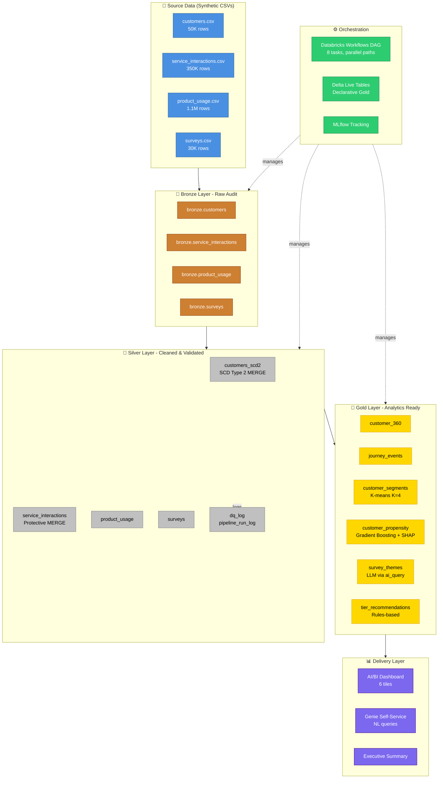

## Architecture

```mermaid
flowchart TB
    subgraph Sources["📁 Source Data (Synthetic CSVs)"]
        S1[customers.csv<br/>50K rows]
        S2[service_interactions.csv<br/>350K rows]
        S3[product_usage.csv<br/>1.1M rows]
        S4[surveys.csv<br/>30K rows]
    end

    subgraph Bronze["🥉 Bronze Layer - Raw Audit"]
        B1[bronze.customers]
        B2[bronze.service_interactions]
        B3[bronze.product_usage]
        B4[bronze.surveys]
    end

    subgraph Silver["🥈 Silver Layer - Cleaned & Validated"]
        SI1[customers_scd2<br/>SCD Type 2 MERGE]
        SI2[service_interactions<br/>Protective MERGE]
        SI3[product_usage]
        SI4[surveys]
        DQ[dq_log<br/>pipeline_run_log]
    end

    subgraph Gold["🥇 Gold Layer - Analytics Ready"]
        G1[customer_360]
        G2[journey_events]
        G3[customer_segments<br/>K-means K=4]
        G4[customer_propensity<br/>Gradient Boosting + SHAP]
        G5[survey_themes<br/>LLM via ai_query]
        G6[tier_recommendations<br/>Rules-based]
    end

    subgraph Delivery["📊 Delivery Layer"]
        D1[AI/BI Dashboard<br/>6 tiles]
        D2[Genie Self-Service<br/>NL queries]
        D3[Executive Summary]
    end

    subgraph Orchestration["⚙️ Orchestration"]
        O1[Databricks Workflows DAG<br/>8 tasks, parallel paths]
        O2[Delta Live Tables<br/>Declarative Gold]
        O3[MLflow Tracking]
    end

    Sources --> Bronze
    Bronze --> Silver
    Silver --> Gold
    Silver -.->|logs| DQ
    Gold --> Delivery
    Orchestration -.->|manages| Bronze
    Orchestration -.->|manages| Silver
    Orchestration -.->|manages| Gold

    classDef bronze fill:#CD7F32,stroke:#8B4513,color:#fff
    classDef silver fill:#C0C0C0,stroke:#808080,color:#000
    classDef gold fill:#FFD700,stroke:#DAA520,color:#000
    classDef source fill:#4A90E2,stroke:#2C5F8D,color:#fff
    classDef delivery fill:#7B68EE,stroke:#4B0082,color:#fff
    classDef orch fill:#2ECC71,stroke:#1E8449,color:#fff

    class B1,B2,B3,B4 bronze
    class SI1,SI2,SI3,SI4,DQ silver
    class G1,G2,G3,G4,G5,G6 gold
    class S1,S2,S3,S4 source
    class D1,D2,D3 delivery
    class O1,O2,O3 orch
```
